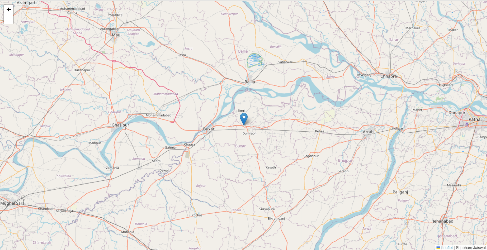

# Real-Time Location Tracker

A real-time location tracker application that displays the locations of all online users using WebSockets via **Socket.IO**. The app provides seamless updates for connected users in real-time and is built with **React**, **Express**, and **Socket.IO**.

[Live Demo](https://maps-d6jv.onrender.com/)

---

## Overview
This project aims to create a dynamic and interactive map-based interface to track users' real-time locations. The application leverages the power of WebSockets to enable instant updates whenever users join, leave, or update their location.

---

## Features
- **Real-Time Updates:** Instantly see the location of every online user.
- **Socket.IO Integration:** Smooth and efficient bi-directional communication.
- **Interactive Map:** User-friendly interface to visualize locations.
- **Responsive Design:** Optimized for various screen sizes.

---

## Screenshots
### Real-Time Location Tracking:


---

## Technologies Used

### Frontend
- **React:** For creating a dynamic and responsive UI.

### Backend
- **Express.js:** For building the server.
- **Socket.IO:** For real-time communication.
- **EJS:** Template engine for server-side rendering.

### Hosting
- Hosted on Render: [Live Demo](https://maps-d6jv.onrender.com/)

---

## Dependencies
```json
{
  "dependencies": {
    "ejs": "^3.1.10",
    "express": "^4.19.2",
    "socket.io": "^4.7.5"
  }
}
```

---

## Installation

### Prerequisites
- Node.js and npm installed.

### Steps
1. Clone the repository:
   ```bash
   git clone https://github.com/shubham-jaishu/Group_Locator.git
   ```

2. Navigate to the project directory:
   ```bash
   cd Group_Locator
   ```

3. Install dependencies:
   ```bash
   npm install
   ```

4. Start the development server:
   ```bash
   npm start
   ```

5. Open your browser and navigate to:
   ```
   http://localhost:3000
   ```

---

## How It Works
1. **User Connection:** When a user connects, their location is sent to the server.
2. **Broadcast Updates:** The server broadcasts the updated location list to all connected users.
3. **Real-Time Map:** The frontend dynamically updates to reflect the changes.

---

## Future Improvements
- Add user authentication.
- Implement geofencing alerts.
- Save user locations to a database for historical tracking.

---

## License
This project is licensed under the MIT License. See the LICENSE file for details.

---

## Contribution
Contributions are welcome! Feel free to fork the repository and submit a pull request.

---

## Contact
For queries or feedback, please contact [Shubham](mailto:shubhamjaishu@gmail.com).
